# TRIỂN KHAI PHÂN TÍCH LOG VỚI WAUZH VÀ ĐÁNH GIÁ HỆ THỐNG ĐÃ ĐƯỢC TRIỂN KHAI

## 1. Môi trường thực nghiệm

### 1.1. Mô hình tổng quát hệ thống

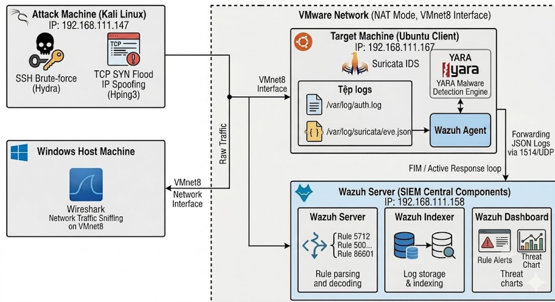

### 1.2. Cấu hình phần cứng

**Bảng 2: Cấu hình phần cứng hệ thống**

| Thành phần hệ thống | Hệ điều hành triển khai | CPU | RAM | Địa chỉ IP |
| :--- | :--- | :--- | :--- | :--- |
| Máy chủ giám sát tập trung (Wazuh Server) | Ubuntu Server 24.04 LTS | 2 Cores | 8 GB | 192.168.111.158 |
| Máy mục tiêu (Client) | Ubuntu Client 24.04 LTS | 2 Cores | 4 GB | 192.168.111.167 |
| Máy thực hiện tấn công (Attacker) | Kali Linux (2024.4) | 2 Cores | 2 GB | 192.168.111.147 |
| Máy chủ vật lý (Host environment) | Windows 11 Home | AMD Ryzen 7 6800H (3.20 GHz) | 16 GB | - |

---

## 2. Kịch bản tấn công

### 2.1. Kịch bản tấn công vét cạn mật khẩu (SSH brute-force)

**a) Mục tiêu**

Trong môi trường thực nghiệm, kịch bản tấn công mô phỏng hành vi brute force SSH vào máy Ubuntu Client có địa chỉ IP `192.168.111.167`. Mục đích của kịch bản là dò tìm mật khẩu của máy Ubuntu Client và dữ liệu của cuộc tấn công sẽ phục vụ giám sát và phân tích.

**b) Công cụ sử dụng**

Trước khi tiến hành mô phỏng và đánh giá kịch bản tấn công, việc lựa chọn và chuẩn bị các phần mềm, công cụ hỗ trợ là bước quan trọng nhằm bảo đảm quá trình thực nghiệm diễn ra chính xác và hiệu quả. Các phần mềm được sử dụng trong đề tài bao gồm những công cụ phục vụ cho việc xây dựng môi trường tấn công, tự động hóa quá trình thực nghiệm, cũng như hỗ trợ thu thập và phân tích dữ liệu log. Cụ thể, hệ thống phần mềm được triển khai trên máy tấn công, máy chủ và máy mục tiêu như bảng:

**Bảng 3: Công cụ thực hiện tấn công vét cạn mật khẩu**

| Thành phần | Công cụ sử dụng | Vai trò/Mục đích |
| :--- | :--- | :--- |
| Máy kiểm thử (Môi trường) | VMware Workstation | Nền tảng ảo hóa để khởi chạy, cấu hình mạng và quản lý song song 3 máy ảo (VM) phục vụ bài lab |
| Máy giám sát (Wazuh SIEM) | Ubuntu + Wazuh Central Components (Indexer, Server, Dashboard) | Máy ảo trung tâm đóng vai trò tiếp nhận log từ máy mục tiêu, khớp dữ liệu với các rule ID xác thực thất bại liên tiếp để kích hoạt cảnh báo Brute-force trên Wazuh Dashboard. |
| Máy mục tiêu (Endpoint) | Ubuntu + dịch vụ OpenSSH + Wazuh Agent | Máy ảo đóng vai trò là nạn nhân bị tấn công. Dịch vụ OpenSSH sẽ sinh log xác thực (auth.log), và Wazuh Agent sẽ thu thập các log này để đẩy về máy chủ giám sát. |
| Máy tấn công (Attacker) | Kali Linux + Công cụ Hydra | Máy ảo đóng vai trò là kẻ tấn công, sử dụng công cụ chuyên dụng để thực hiện rải mật khẩu (Brute-force) qua giao thức SSH vào máy mục tiêu. |
| Môi trường mạng | VMware Virtual Network | Thiết lập đường truyền nội bộ riêng biệt, an toàn để máy Kali Linux có thể kết nối mạng và gửi traffic tấn công trực tiếp sang IP của máy mục tiêu Ubuntu. |

### 2.2. Kịch bản tấn công từ chối dịch vụ (DoS)

**a) Mục tiêu**

Trong môi trường thực nghiệm, kịch bản này mô phỏng một cuộc tấn công từ chối dịch vụ bằng phương thức TCP SYN Flood kết hợp mạo danh IP (IP Spoofing) nhắm vào máy mục tiêu Ubuntu Client có địa chỉ IP `192.168.111.167`. Mục đích của kịch bản là phát hiện tấn công DoS thông qua Suricata IDS kết hợp với Wazuh để giám sát tập trung, phục vụ giám sát và phân tích.

**b) Công cụ sử dụng**

Trước khi tiến hành mô phỏng và đánh giá kịch bản tấn công, việc lựa chọn và chuẩn bị các phần mềm, công cụ hỗ trợ là bước quan trọng nhằm bảo đảm quá trình thực nghiệm diễn ra chính xác và hiệu quả. Các phần mềm được sử dụng bao gồm những công cụ phục vụ cho việc giả lập luồng tấn công phân tán, bắt gói tin tầng mạng, cũng như hỗ trợ thu thập và phân tích dữ liệu log tập trung. Cụ thể, hệ thống phần mềm và công cụ triển khai cho kịch bản DoS được thể hiện chi tiết tại bảng:

**Bảng 4: Công cụ thực hiện tấn công từ chối dịch vụ**

| Thành phần | Công cụ sử dụng | Vai trò/Mục đích |
| :--- | :--- | :--- |
| Máy kiểm thử (Môi trường) | VMware Workstation | Nền tảng ảo hóa để khởi chạy, cấu hình mạng nội bộ và quản lý song song các máy ảo (VM) phục vụ bài Lab. |
| Máy giám sát (Wazuh SIEM) | Ubuntu + Wazuh Central Components (Indexer, Server, Dashboard) | Máy chủ trung tâm đóng vai trò tiếp nhận log tập trung, phân tích dữ liệu dựa trên các Rule ID được cấu hình để đưa ra cảnh báo DDoS trên giao diện đồ họa. |
| Máy mục tiêu (Endpoint) | Ubuntu Client + Wazuh Agent + Suricata IDS | Đóng vai trò là nạn nhân bị tấn công. Suricata IDS rình bắt, phân tích gói tin mạng để sinh log thô; Wazuh Agent thực hiện thu thập và chuyển tiếp log từ Suricata về máy chủ. |
| Máy tấn công (Attacker) | Kali Linux + Công cụ Hping3 | Máy ảo đóng vai trò là hacker, sử dụng công cụ Hping3 với tham số cấu hình cao để phát tán hàng triệu gói tin TCP SYN giả mạo IP nguồn vào hệ thống. |
| Thiết bị bắt gói tin (Máy vật lí) | Windows Host + Wireshark Tool | Máy vật lý chạy phần mềm Wireshark, thực hiện lắng nghe trực tiếp trên card mạng ảo trung gian VMware Network Adapter VMnet8 để ghi lại toàn bộ lưu lượng mạng thô phục vụ đối chiếu, phân tích gói tin |
| Môi trường mạng | VMware Virtual Network (NAT Mode) | Thiết lập đường truyền logic kết nối các máy ảo thông qua switch ảo VMnet8. Luồng traffic tấn công từ Kali truyền sang Ubuntu Client sẽ chạy qua con switch ảo này, giúp Wireshark trên máy thật có thể tóm gọn dữ liệu một cách thông suốt. |

### 2.3. Kịch bản phát hiện tệp tin độc hại

**a) Mục tiêu**

Trong môi trường thực nghiệm, kịch bản này mô phỏng hành vi phát tán tệp tin độc hại thông qua việc đưa mã độc dòng Mirai vào thư mục giám sát `/tmp/yara/malware/` trên máy Ubuntu Client. Mục đích của kịch bản nhằm chứng minh năng lực giám sát tính toàn vẹn tệp tin theo thời gian thực kết hợp với sức mạnh của công cụ quét chữ ký mã độc YARA, từ đó kích hoạt cơ chế Active Response tự động xử lý và đẩy cảnh báo tập trung về hệ thống Wazuh để theo dõi và phân tích.

**b) Công cụ sử dụng**

Trước khi tiến hành mô phỏng và đánh giá kịch bản, việc chuẩn bị các phân hệ chức năng và luật quét là bước quyết định nhằm đảm bảo luồng phản ứng tự động diễn ra chính xác. Các phần mềm và công cụ được triển khai cho kịch bản phát hiện mã độc được thể hiện chi tiết tại bảng dưới đây:

**Bảng 5: Công cụ thực hiện phát hiện tệp tin độc hại**

| Thành phần | Công cụ sử dụng | Vai trò/Mục đích |
| :--- | :--- | :--- |
| Máy kiểm thử (Môi trường) | VMware Workstation | Nền tảng ảo hóa quản lý các máy ảo phục vụ bài Lab. |
| Máy giám sát (Wazuh SIEM) | Ubuntu + Wazuh Central Components (Indexer, Server, Dashboard) | Trung tâm tiếp nhận log, phân tích dữ liệu dựa trên để đưa ra cảnh báo mã độc trùng khớp trên giao diện đồ họa. |
| Máy mục tiêu (Endpoint) | Ubuntu Client + Wazuh Agent + YARA Engine | Đóng vai trò là nạn nhân bị phát tán file độc hại. FIM giám sát thời gian thực thư mục chỉ định; khi có biến động, Active Response tự động gọi công cụ YARA kiểm tra chữ ký file dựa trên tập luật mẫu để sinh log bảo mật. |
| Mẫu thử nghiệm | Tệp tin giả lập Mirai (ELF Linux) | Mẫu tệp tin mang chuỗi định danh đặc trưng của dòng phần mềm độc hại Mirai nhằm kích nổ bẫy quét của hệ thống. |

---

## 3. Triển khai kịch bản và phân tích kết quả

### 3.1. Thực hiện kịch bản tấn công SSH brute-force

**a) Thực hiện kịch bản**

Để thực nghiệm mô phỏng kịch bản tấn công vét cạn mật khẩu giao thức SSH, quá trình triển khai được thực hiện tuần tự qua 3 bước cấu hình và thực thi như sau:

- **Bước 1: Chuẩn bị danh sách từ điển mật khẩu trên máy tấn công (Kali Linux)**
  Trong bài thực nghiệm này, để tối ưu hóa thời gian demo nhưng vẫn đảm bảo tính thực tế, kẻ tấn công tạo một file mật khẩu chứa các chuỗi ký tự thông dụng, trong đó có chèn một mật khẩu chính xác của máy mục tiêu vào giữa danh sách.

  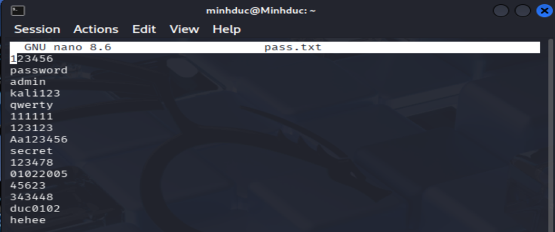

- **Bước 2: Cấu hình trình nghe nhật ký trên máy mục tiêu (Ubuntu Client)**
  Trên máy Ubuntu truy cập vào Terminal dưới quyền root, thực thi lệnh giám sát luồng ghi nhật ký xác thực hệ thống theo thời gian thực để chuẩn bị quan sát biến động dữ liệu.

- **Bước 3: Khởi động luồng tấn công vét cạn bằng công cụ Hydra từ máy Kali Linux**
  Trên máy Kali Linux, kẻ tấn công mở Terminal và sử dụng công cụ Hydra để thực hiện hành vi dò quét mật khẩu tự động vào dịch vụ OpenSSH đang chạy trên cổng 22 của nạn nhân.

  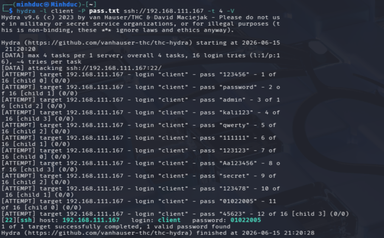

**b) Ghi nhận và xử lý log trong quá trình thực hiện kịch bản**

Trong suốt tiến trình thực nghiệm kịch bản tấn công vét cạn mật khẩu, mọi hành vi tương tác độc hại từ máy tấn công (Kali Linux) dội vào cổng 22 của máy mục tiêu (Ubuntu Client) đều để lại dấu vết số tầng hệ điều hành. Tiến trình xử lý, phân tích và chuyển tiếp nhật ký hoạt động phối hợp chặt chẽ theo mô hình log tập trung.

*Giai đoạn thứ nhất ghi nhận nhật ký hệ thống tại tệp tin auth.log.* 

Trong hệ điều hành Ubuntu, tệp tin `/var/log/auth.log` là nơi chuyên trách ghi nhận toàn bộ các sự kiện liên quan đến xác thực hệ thống, bao gồm trạng thái phân hệ bảo mật và tiến trình quản lý kết nối từ xa. Cứ mỗi một yêu cầu đăng nhập sai do công cụ Hydra rải mật khẩu tự động nhắm vào tài khoản client, tiến trình sshd lập tức từ chối phiên và xuất trực tiếp một dòng bản ghi sự kiện vào tệp `/var/log/auth.log`.

  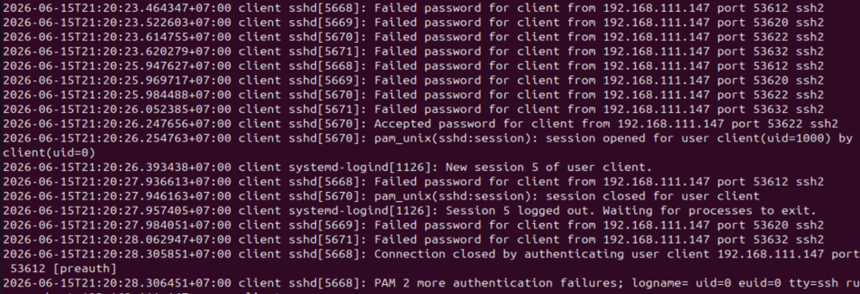
    
*Giai đoạn thứ hai: Thu thập và chuyển tiếp của Wazuh Agent.* 

Tiến trình `wazuh-logcollector` cấu hình tại endpoint liên tục theo dõi biến động dung lượng của tệp `/var/log/auth.log` theo thời gian thực. Ngay khi xuất hiện dòng dữ liệu mới, Agent thực hiện đọc, đóng gói nội dung dòng văn bản thô đó thành các gói tin định dạng bản tin có cấu trúc và truyền tải an toàn về máy chủ giám sát tập trung (Wazuh Server) qua cổng dịch vụ mặc định `1514/UDP`.

*Giai đoạn thứ ba: Chuẩn hóa dữ liệu và kích hoạt Rule tại Wazuh Server*

Tại máy chủ trung tâm, dòng log văn bản thô đi vào phân hệ giải mã (Decoders) để tiến hành bóc tách văn bản dựa trên các biểu thức chính quy. Văn bản thô ban đầu được chuẩn hóa hoàn toàn thành các trường dữ liệu logic bao gồm:

- `srcip`: Địa chỉ IP nguồn tấn công.
- `dstuser`: Tài khoản hệ thống bị tác động.
- `event.outcome`: Kết quả trạng thái xác thực.

Dữ liệu sau chuẩn hóa được đẩy qua bộ lọc phân tích luật. Do tần suất log xác thực lỗi dồn dập vượt ngưỡng an toàn trong một đơn vị thời gian ngắn, hệ thống tự động đối khớp và kích hoạt các Rule ID mặc định.

 **c) Phân tích và trực quan hóa kết quả trên Dashboard**

Sau khi các bộ luật bị kích hoạt trên máy chủ, toàn bộ dữ liệu cảnh báo lập tức được đồng bộ và lập chỉ mục lưu trữ tập trung, phục vụ công tác trực quan hóa và điều tra sự cố thông qua giao diện đồ họa Wazuh Dashboard.

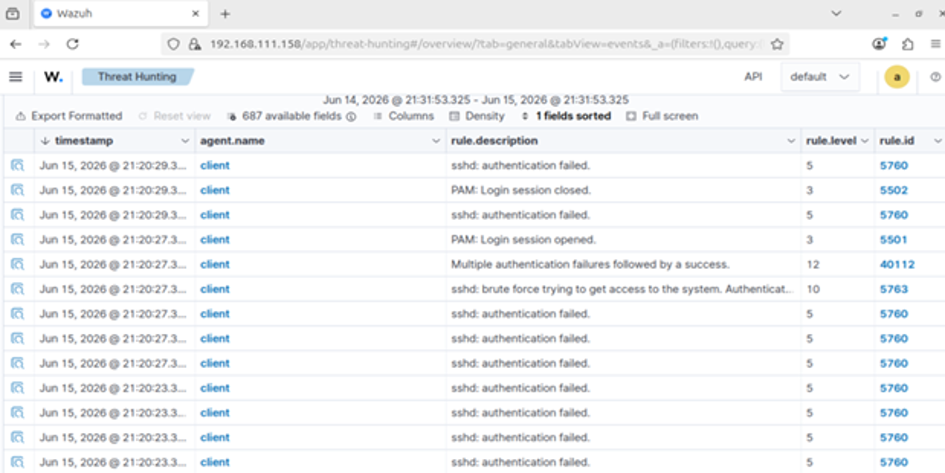

Màn hình quản lý sự kiện của Wazuh tổ chức dữ liệu theo cấu trúc bảng cực kỳ tường minh với các cột thông tin then chốt, ghi lại tất cả "dấu vết" của cuộc tấn công brute-force:

- *Mốc thời gian (timestamp):* Ghi nhận chuỗi hành vi dồn dập xảy ra vào ngày Jun 15, 2026. Các sự kiện xuất hiện dày đặc chỉ cách nhau vài mili-giây, minh chứng cho tốc độ dò quét cực nhanh của cuộc tấn công.

- *Định danh mục tiêu (agent.name):* Toàn bộ các dòng log đều chỉ đích danh máy nạn nhân là `client`, khẳng định endpoint này đang là mục tiêu duy nhất bị tấn công.

- *Mô tả chi tiết luật (rule.description):* Wazuh Dashboard thể hiện tư duy phân tích rất rõ ràng thông qua việc phân loại mô tả sự kiện:
  - Các dòng trạng thái `sshd: authentication failed.` xuất hiện liên tục ứng với các gói tin thử sai mật khẩu.
  - Dòng cảnh báo `sshd: brute force trying to get access to the system. Authentication failed.` vạch trần hành vi dò quét vét cạn mật khẩu hệ thống.
  - Đặc biệt, dòng thông báo `Multiple authentication failures followed by a success.` xuất hiện đè lên trên, khẳng định sau hàng loạt lượt thử sai thì kẻ tấn công đã dò ra mật khẩu đúng và đăng nhập thành công.

- *Đánh giá mức độ nguy hiểm (rule.level và rule.id):* Đây là chứng cứ quan trọng nhất để phân cấp độ sự cố trong đồ án:
  - `Rule.id 5760 (Level 5)`: Cảnh báo mức độ thấp cho một lần đăng nhập thất bại đơn lẻ.
  - `Rule.id 5763 (Level 10)`: Cảnh báo mức độ cao khi hệ thống nhận diện được hành vi brute-force.
  - `Rule.id 40112 (Level 12)`: Cảnh báo mức độ nguy cấp xác nhận cuộc tấn công bẻ khóa đã thành công, hacker đã chính thức chiếm quyền điều khiển.
### 3.2. Thực hiện kịch bản tấn công từ chối dịch vụ (DoS)

 **a) Thực hiện kịch bản**

Để triển khai thực nghiệm mô phỏng cuộc tấn công từ chối dịch vụ bằng phương thức TCP SYN Flood kết hợp mạo danh IP (IP Spoofing), quá trình thực hiện được chia làm 3 bước:

- *Bước 1: Khởi động hệ thống bắt gói tin Wireshark trên máy vật lý (Host)*
    + Trên hệ điều hành máy thật (Windows Host), khởi chạy phần mềm Wireshark.
    + Tại giao diện danh sách card mạng, tiến hành nhấp đúp chuột vào card mạng ảo trung gian mang tên VMware Network Adapter VMnet8 (đây là card mạng chịu trách nhiệm định tuyến luồng dữ liệu cấu hình theo chế độ NAT Mode của VMware).
    + Hệ thống Wireshark bắt đầu lắng nghe và ghi nhận lưu lượng mạng ở trạng thái thời gian thực.

- *Bước 2: Kích hoạt chế độ giám sát mạng trên máy mục tiêu*

    Thực hiện khởi động lại dịch vụ Suricata để hệ thống nhận diện tấn công mạng vào bộ nhớ.

- *Bước 3: Phát động luồng tấn công từ máy Kali Linux*

    Trên máy tấn công Kali Linux, kẻ tấn công mở Terminal và sử dụng công cụ Hping3 để phát tán hàng triệu gói tin TCP SYN giả mạo IP nguồn vào cổng dịch vụ OpenSSH (Port 22) của nạn nhân.

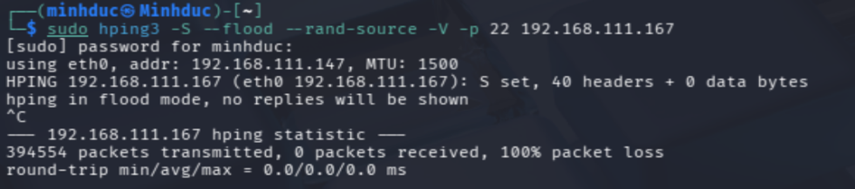

**b) Ghi nhận và xử lí log trong quá trình thực hiện kịch bản**

Trong suốt quá trình cuộc tấn công diễn ra, luồng traffic độc hại dội vào hệ thống được ghi nhận và xử lý phân tầng chặt chẽ qua các giai đoạn từ hiệu năng tài nguyên phần cứng, bắt gói tin mạng thô đến phân tích log tập trung:

- *Giai đoạn 1: Đánh giá biến động hiệu năng tài nguyên phần cứng máy client*

    + Ta giám sát hệ thống trên máy Ubuntu Client, trạng thái cạn kiệt tài nguyên của máy chủ đã lộ rõ do phải xử lí lượng traffic quá lớn.

    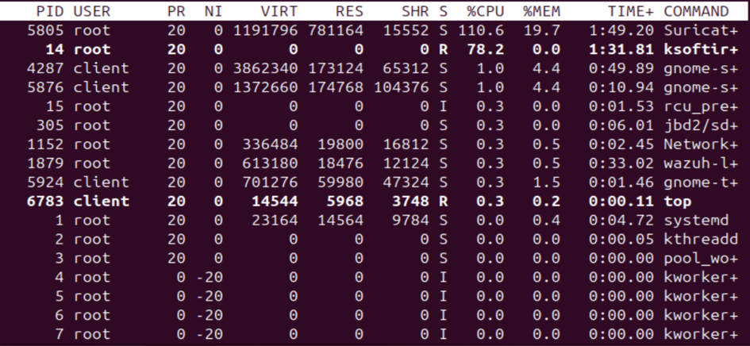

    + Phân tích thông số phần cứng từ thực nghiệm:
        - Tiến trình Suricata (PID 5805) chiếm dụng hiệu năng xử lý ở ngưỡng cực hạn lên tới 110.6% CPU và ngốn 19.7% bộ nhớ RAM. Điều này phản ánh phân hệ IDS đang phải vắt kiệt công suất phần cứng để bóc tách luồng traffic rác nhằm kịp thời ghi nhật ký sự kiện.
        - Đặc biệt, tiến trình quản lý các Ngắt mềm của nhân hệ điều hành `ksoftirqd` (PID 14) tăng vọt lên mức 78,2% CPU. Thông số này chứng minh hàng vạn gói tin tràn ngập vào card mạng trong thời gian ngắn đã ép nhân kernel của Linux phải liên tục sinh ngắt để tiếp nhận dữ liệu, gây ra tình trạng nghẽn mạch logic hệ thống. Máy chủ rơi vào trạng thái cạn kiệt tài nguyên và mất năng lực phản hồi.

- *Giai đoạn 2: Phân tích và bắt gói tin mạng thô (Wireshark & Suricata IDS)*
    + Do hệ thống phòng Lab ảo hóa được định tuyến thông qua switch ảo VMnet8 theo chế độ NAT Mode, công cụ Wireshark khởi chạy trên máy vật lý (Windows Host) đã chụp lại toàn bộ dữ liệu thô chuyển dịch giữa hai máy ảo.
    + Khi quản trị viên áp dụng bộ lọc điều kiện chuyên sâu, hệ thống lập tức cô lập và hiển thị một loạt gói tin màu xám. Tại cột Source, hệ thống vạch trần hàng loạt địa chỉ IP nguồn ngẫu nhiên đang liên tục gửi yêu cầu khởi tạo kết nối TCP SYN với tần suất mili-giây nhắm vào địa chỉ IP đích `192.168.111.167` tại cổng dịch vụ SSH (Port 22). Điều này chứng minh đây một cuộc tấn công từ chối dịch vụ phân tán diện rộng.

    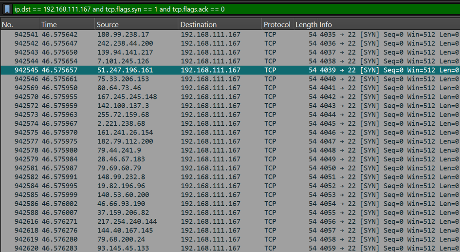

    + Song song với đó, tại máy trạm nạn nhân, công cụ Suricata IDS liên tục thực hiện phân tích sâu các gói tin. Ngay khi lưu lượng cờ `[SYN]` dội vào card mạng vượt quá ngưỡng thiết lập an toàn trong file quy tắc cục bộ, Suricata lập tức định danh hành vi bất thường, biên dịch sự kiện xâm nhập mạng và xuất trực tiếp log thô định dạng JSON vào tệp tin nhật ký bảo mật tại đường dẫn: `/var/log/suricata/eve.json`.

- *Giai đoạn 3: Thu thập và chuẩn hoá dữ liệu của phân hệ Wazuh Agent*
    + Tiến trình `wazuh-logcollector` chạy ngầm tại Endpoint liên tục giám sát tệp tin `/var/log/suricata/eve.json` theo cơ chế thời gian thực.
    + Ngay khi Suricata kết xuất bản ghi cấu trúc mới, Wazuh Agent lập tức thực hiện đọc, đóng gói luồng dữ liệu độc hại này thành các bản tin JSON bảo mật và truyền tải tập trung về trung tâm xử lý dữ liệu (Wazuh Server) thông qua giao thức mã hóa qua cổng dịch vụ 1514/UDP.

- *Giai đoạn 4: Phân tích tương quan luật tại phân hệ Wazuh Server*
    + Tại máy chủ trung tâm, luồng dữ liệu thô từ Agent gửi sang được đẩy qua phân hệ giải mã (Decoders). Tại đây, cấu trúc cú pháp JSON của Suricata được bóc tách hoàn toàn thành các trường thông tin logic có cấu trúc rõ ràng.
    + Dữ liệu sau chuẩn hóa tiếp tục đi vào bộ lọc phân tích luật. Nhận diện chuỗi cảnh báo tương thích phản ánh tấn công nghẽn hàng đợi kết nối, Wazuh Server tự động đối khớp mạng và kích hoạt mã luật bảo mật chuyên trách tầng mạng.

**c) Phân tích và trực quan hoá kết quả trên Dashboard**

Sau khi máy chủ xử lý và lập chỉ mục thành công, toàn bộ dữ liệu lưu lượng cuộc tấn công DoS được đồng bộ trực quan hóa lên giao diện đồ họa Wazuh Dashboard.

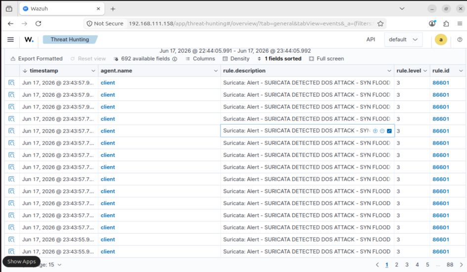

Màn hình quản lý chuyên trách tổ chức dữ liệu theo cấu trúc bảng cực kỳ khoa học, cung cấp toàn bộ các chứng cứ đắt giá để phục vụ công tác điều tra sự cố:

- *Mốc thời gian (timestamp):* Ghi nhận chuỗi hành vi xảy ra vào ngày Jun 15, 2026. Khoảng thời gian cuộc tấn công dội bom làm nghẽn dịch vụ được cô lập chính xác tuyệt đối.

- *Định danh hạ tầng mục tiêu (agent.name):* Trường thông tin này khẳng định endpoint này là mục tiêu duy nhất chịu áp lực tải luồng dữ liệu độc hại và đang rơi vào trạng thái cạn kiệt tài nguyên hàng đợi kết nối.

- *Mô tả chi tiết hành vi sự cố (rule.description):* Bảng hiển thị xuất ra chuỗi thông tin vạch trần hành vi tấn công mạng: `Suricata: Alert - SURICATA DETECTED DOS ATTACK - SYN FLOOD`. Thông điệp này là minh chứng đắt giá vạch trần bản chất đòn càn quét luồng kết nối TCP SYN của hacker; đồng thời khẳng định sự phối hợp đồng bộ, chính xác giữa phân hệ Suricata (lắng nghe, phân tích traffic mạng thô) và phân hệ SIEM Wazuh (quản lý, tiếp nhận log và hiển thị tập trung).

- *Phân cấp độ nghiêm trọng và mã định danh an ninh (rule.level và rule.id):* Toàn bộ chuỗi dữ liệu dội bom dồn dập đều khớp chính xác vào mã `Rule.id: 86601` ứng với cấp độ cảnh báo an ninh `Rule.level: 3` hiển thị trực quan theo hàng dọc trên Dashboard. Con số này chứng minh hệ thống đã nhận diện thành công đòn tấn công dựa trên quy tắc tính toán giới hạn ngưỡng tần suất kết nối chứ không bị đánh lừa bởi kỹ thuật mạo danh hàng loạt IP nguồn (IP Spoofing) của kẻ tấn công.


### 3.3. Thực hiện kịch bản phát hiện tệp tin độc hại với YARA

 **a) Thực hiện kịch bản**

Để thực nghiệm mô phỏng cơ chế tự động phát hiện mã độc dựa trên tương quan FIM và YARA, quá trình triển khai trên máy mục tiêu (Ubuntu Client) được thực hiện tuần tự qua các bước cấu hình và thực thi hệ thống như sau:

*Bước 1: Khởi tạo cấu trúc thư mục lưu trữ chuyên trách cục bộ*

Do cấu trúc thư mục tạm mặc định có thể bị xóa hoặc chưa đồng bộ, quản trị viên sử dụng lệnh `mkdir` với tham số `-p` để khởi tạo chuỗi thư mục con `/tmp/yara/malware/`. Tham số này đảm bảo nếu thư mục cha chưa tồn tại, hệ thống sẽ tự động tạo lập để tránh các lỗi thiếu đường dẫn hệ thống:

```bash
sudo mkdir -p /tmp/yara/malware
```
*Bước 2: Tải mẫu thử mã độc dòng Mirai từ kho lưu trữ tài nguyên*

Ta sử dụng công cụ `curl` để tải tệp mẫu giả lập mang chuỗi ký tự nhận diện đặc trưng của dòng mã độc Mirai trực tiếp từ máy chủ tài nguyên chính thức của Wazuh. Tệp tin sau khi tải về được kết xuất và lưu thành một tệp tin thực thi mới mang tên `mirai_quyen_nang` đặt vào bên trong thư mục vừa khởi tạo nhằm mô phỏng hành vi phát tán cấu trúc mã độc:

```bash
sudo curl -s -XGET https://raw.githubusercontent.com/wazuh/wazuh-documentation/refs/heads/4.14/resources/samples/mirai -o "/tmp/yara/malware/mirai_quyen_nang"
```
*Bước 3: Ghi nhận và giám sát tiến trình phản ứng tự động cục bộ*

Ngay sau khi tệp tin độc hại được đưa vào vùng giám sát thời gian thực (Real-time FIM), phân hệ Active Response sẽ tự động kích hoạt. Quản trị viên thực hiện lệnh kiểm tra tệp nhật ký bảo mật chuyên trách để xác thực luồng quét và xử lý sự cố tự động của hệ thống:

```bash
sudo tail -n 10 /var/ossec/logs/active-responses.log
```
 **b) Ghi nhận và xử lí log trong quá trình thực hiện kịch bản**

Ngay khi tệp tin `mirai_quyen_nang` được ghi thành công vào ổ đĩa tại Bước 2, luồng dữ liệu an ninh và phản ứng tự động giữa Wazuh Agent và Wazuh Server được kích hoạt đồng bộ qua các giai đoạn logic chặt chẽ:

*Giai đoạn 1: Đón bắt sự kiện FIM thời gian thực tại Ubuntu Client*

Tiến trình `wazuh-syscheckd` cấu hình tại máy Ubuntu Client liên tục giám sát thư mục `/tmp/yara/malware/`. Sự kiện thêm mới tệp tin `mirai_quyen_nang` lập tức bị tóm gọn, đóng gói thành bản tin có cấu trúc và chuyển tiếp an toàn về máy chủ giám sát tập trung (Wazuh Server) qua cổng dịch vụ 1514/UDP.

*Giai đoạn 2: Phân tích tương quan luật và kích hoạt ứng phó tự động*

Tại máy chủ trung tâm, luồng dữ liệu thô từ Agent gửi sang được đẩy qua giải mã. Hệ thống đối khớp sự kiện với mã quy tắc định nghĩa chuyên trách giám sát thư mục. Do quy tắc Active Response đã được thiết lập liên kết bẫy, Server phát lệnh điều khiển ngược trở lại máy Client, ép Agent gọi kịch bản thực thi `yara.sh`.

**Giai đoạn 3: YARA Engine quét chữ ký và kết xuất nhật ký thành công**

Kịch bản `yara.sh` hoạt động dưới quyền tối cao, gọi tiến trình `/usr/local/bin/yara` tiến hành bóc tách và đọc sâu vào cấu trúc dữ liệu tệp tin dựa trên tập luật đối khớp quy tắc chữ ký mã độc `yara_rules.yar`. Hệ thống định danh chính xác tệp tin trùng khớp với mẫu signature của dòng Mirai và kết xuất trực tiếp dòng thông báo vào tệp log Active Response cục bộ.

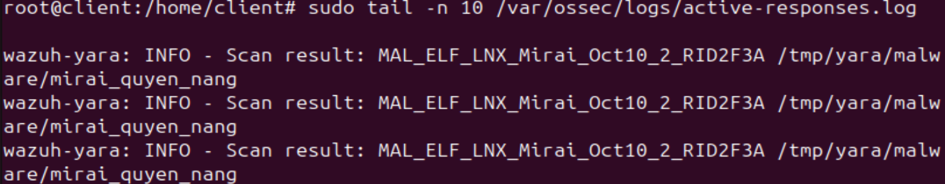

**Giai đoạn 4: Chuẩn hóa dữ liệu và nâng cấp độ cảnh báo tập trung trên SIEM**

Bản ghi INFO từ file log cục bộ tiếp tục được Agent đẩy ngược lên Server. Phân hệ giải mã (Decoders) của Server tiến hành bóc tách chuỗi chữ thành các trường dữ liệu logic bao gồm: tên luật độc hại cụ thể (`yara_rule`) và đường dẫn tệp bị nhiễm (`yara_scanned_file`), chính thức kích nổ mã cảnh báo chuyên trách.

**c) Phân tích và trực quan hóa kết quả trên Dashboard**

Sau khi máy chủ xử lý dữ liệu, sự kiện xâm nhập lập tức được đồng bộ hóa và lưu trữ tập trung, phục vụ công tác giám sát trực quan thông qua giao diện đồ họa Wazuh Dashboard:

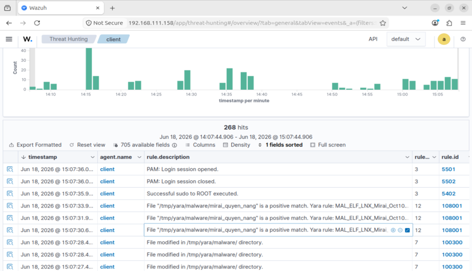

Màn hình quản lý sự kiện Threat Hunting tổ chức dữ liệu theo cấu trúc bảng khoa học, ghi lại toàn bộ "dấu vết" phản ứng tự động của hệ thống:

- *Tương quan mốc thời gian chặt chẽ (timestamp):* Ghi nhận chuỗi hành vi tự động diễn ra tuần tự. Sự kiện FIM phát hiện file bị sửa đổi xuất hiện ở mốc thời gian thực. Ngay lập tức, chỉ cách nhau đúng 1 giây, cảnh báo mã độc YARA trùng khớp đã được đồng bộ về Dashboard. Điều này chứng minh tốc độ phản ứng và xử lý sự cố tự động cực cao của hệ thống.

- *Định danh mục tiêu chính xác (agent.name):* Trường thông tin chỉ đích danh máy nạn nhân là `client`, khẳng định endpoint này đã bị can thiệp và chứa thực thể độc hại.

- *Mô tả chi tiết hành vi sự cố (rule.description):* Hệ thống hiển thị rõ ràng thông báo xác nhận: `File "/tmp/yara/malware/mirai_quyen_nang" is a positive match. Yara rule: MAL_ELF_LNX_Mirai_Oct10_2_RID2F3A.` Thông điệp này chứng minh hệ thống không chỉ dừng lại ở việc phát hiện biến động file vật lý thông thường, mà còn định danh chính xác bản chất thực thể độc hại là dòng mã độc "Mirai" chuyên tấn công các thiết bị Linux.

- *Phân cấp độ nghiêm trọng cao (rule.level và rule.id):* Sự kiện tự động kích nổ mã cảnh báo tùy chỉnh ở cấp độ `level 12`. Chỉ số an ninh này cung cấp một bằng chứng kỹ thuật đắt giá để các kỹ sư vận hành hệ thống lập tức nhận diện mức độ ưu tiên xử lý sự cố, tiến hành cô lập endpoint và ngăn chặn kịp thời hành vi phát tán phần mềm độc hại diện rộng trong mạng nội bộ hạ tầng.

---

## 4. Đánh giá kết quả thực nghiệm

Sau khi triển khai thành công mô hình kịch bản tấn công vét cạn mật khẩu (SSH Brute-force), tấn công từ chối dịch vụ (TCP SYN Flood) và phát hiện tệp tin độc hại với YARA (Malware Detection), hệ thống giám sát an ninh tập trung Wazuh SIEM kết hợp cùng Suricata IDS và YARA Engine mang lại các kết quả đánh giá cốt sau:

### Ưu điểm

- **Năng lực bóc tách và tương quan dữ liệu chính xác cao:** Thông qua phân hệ giải mã (Decoders) của Wazuh Server, dữ liệu từ các nguồn không đồng nhất như tệp nhật ký hệ thống `/var/log/auth.log`, bản tin cấu trúc của Suricata và log phản ứng Active Response của YARA được chuẩn hóa hoàn toàn. Hệ thống bóc tách chính xác các trường thông tin chí mạng như địa chỉ IP nguồn, tài khoản bị can thiệp, tên luật chữ ký mã độc và đường dẫn tệp nhiễm độc.

- **Tốc độ phản ứng tự động hóa theo thời gian thực:** Hệ thống chứng minh khả năng phòng thủ chủ động vượt trội thông qua việc liên kết phân hệ FIM và YARA. Tốc độ phản ứng từ khi Endpoint phát hiện biến động tệp tin cơ học cho đến khi YARA kích hoạt quét sâu, định danh chính xác biến thể mã độc "Mirai" và đẩy cảnh báo nguy cấp (Level 12) về Dashboard chỉ diễn ra trong vòng 1 giây.

- **Trực quan hóa dữ liệu và tối ưu hóa công tác điều tra sự cố:** Giao diện đồ họa Wazuh Dashboard cung cấp khả năng hiển thị biểu đồ tần suất biến động theo mốc thời gian cực kỳ tường minh. Ta có thể dễ dàng kiểm tra, thiết lập bộ lọc để cô lập luồng traffic tấn công hoặc dấu vết phát tán mã độc thông qua ngôn ngữ truy vấn DQL với độ trễ phản hồi dưới 1 giây.

- **Khả năng nhận diện tấn công bất chấp các kỹ thuật ẩn mình:** Hệ thống định danh thành công đòn tấn công từ chối dịch vụ dựa trên quy tắc tính toán giới hạn ngưỡng tần suất kết nối vượt ngưỡng an toàn. Điều này giúp phân hệ giám sát không bị đánh lừa bởi kỹ thuật mạo danh hàng loạt IP nguồn (IP Spoofing) của kẻ tấn công.

### Nhược điểm

- **Mô hình cảnh báo và phòng vệ còn mang tính thụ động:** Hệ thống SIEM Wazuh hiện tại mới chỉ dừng lại ở mức độ thu thập, chuẩn hóa, phân tích luật và hiển thị cảnh báo lên Dashboard.

- **Quy mô hạ tầng thực nghiệm còn hạn chế:** Toàn bộ phòng Lab ảo hóa mới chỉ triển khai trên môi trường VMware Workstation nội bộ thông qua switch ảo VMnet8 với quy mô nhỏ. Do đó, hệ thống chưa đánh giá được toàn diện hiệu năng xử lý phần cứng (tải dung lượng RAM, CPU của máy chủ Wazuh Server) ngoài thực tế khi phải đối mặt với các cuộc tấn công DDoS có lưu lượng băng thông cực lớn.

- **Nguy cơ gây nhiễu loạn và quá tải dữ liệu:** Trong kịch bản tấn công TCP SYN Flood, tốc độ dội bom luồng dữ liệu liên tục sinh ra hàng vạn gói tin chỉ trong vài giây. Nếu cấu hình bộ giới hạn ngưỡng của Suricata IDS không được tối ưu hóa cẩn thận, hệ thống rất dễ rơi vào tình trạng quá tải dữ liệu log rác, gây nghẽn băng thông truyền tải từ Agent về Server.

- **Kịch bản mô phỏng chưa bao quát toàn diện chuỗi tấn công:** Các kịch bản tấn công thực nghiệm mới chỉ giả lập các kỹ thuật xâm nhập cơ bản từ bên ngoài. Mô hình chưa mở rộng và bao quát được các hành vi tấn công nội bộ phức tạp hơn.
